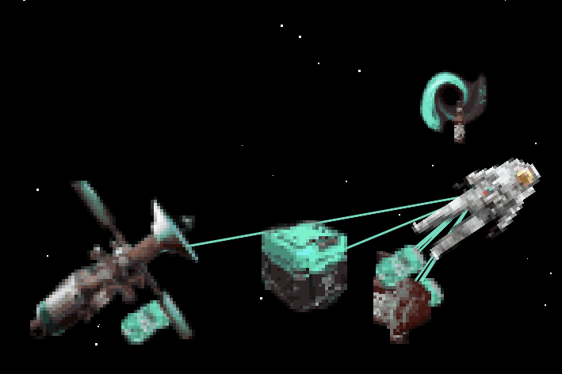

# Wasted Space

My entry to the 2021 JS13K competition. Most of the space is wasted on textures (~8kb), followed by the games code (~4kb). Music takes up the least space after compression (~1kb).

.

Here's the link to the JS13K entry: https://js13kgames.com/entries/no-more-space-in-space

And to the live version on my Website: https://jurasic-park.de/js13k_space/

## Interesting findings: 
- A single png image compresses better than multiple small ones (relatively unsiprising)
- The image compression improved, when all sprites were arranged in a square, instad of a rectangle, even though the total pixel count barely changed
- A well minified code with lots of redundancy compressed better than code that was minified 10% smaller using eval statements, since that one had less redundancy
